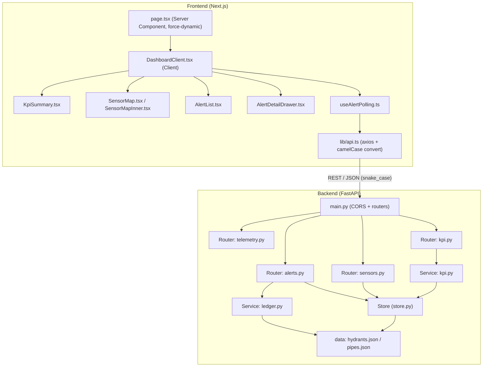
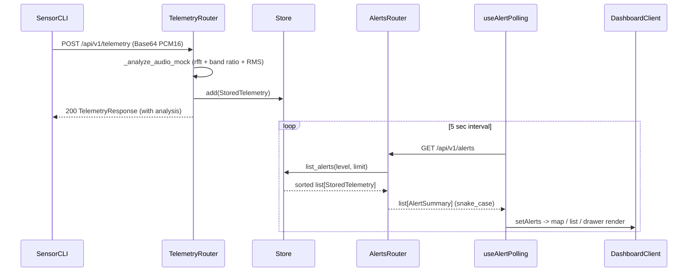
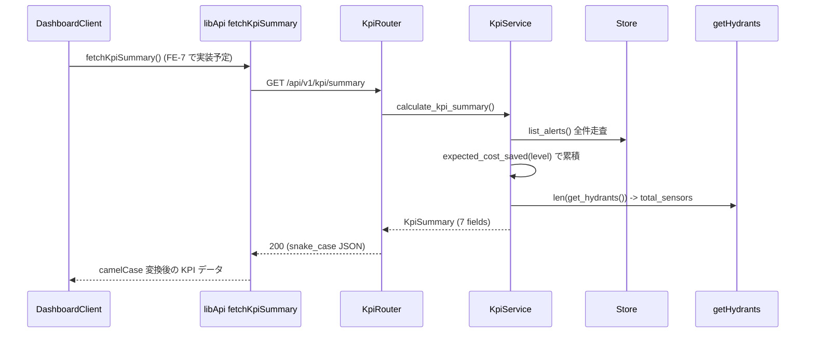

# SmartWater Guardian - システムアーキテクチャ

## アーキテクチャスタイル

単一リポジトリ構成。FastAPI 製**モノリシックバックエンド**（ルーター/サービス/ストアの3層）と
Next.js App Router 製フロントエンド（**Server Component ページ + Client Component ダッシュボード**）で構成。
本番用 DB は持たず、JSON マスタ + インメモリストアでデモを成立させる（CLAUDE.md §3 の範囲外遵守）。

- **バックエンド**: FastAPI（Python / Pydantic v2 strict）。同期 `def` + スレッドプール。
  ルーターは薄く、ビジネスロジックはサービス層（ledger / kpi）、データ保持はスレッドセーフなインメモリストア。
- **フロントエンド**: Next.js App Router。`page.tsx` は Server Component（`force-dynamic`）で
  GeoJSON を取得し、`DashboardClient`（Client Component）へ渡す。アラートはクライアントで 5 秒ポーリング。
  KPI も `DashboardClient` でのポーリング配線（FE-7）を予定。

## コンポーネント関係図

（テキスト代替: フロントは `page.tsx` → `DashboardClient` → KpiSummary / SensorMap / AlertList /
AlertDetailDrawer。データ取得は `lib/api.ts`（axios + snake_case→camelCase 変換）が一本化し、
ポーリングは `useAlertPolling` が担う。バックエンドは `main.py` → 4 ルーター（telemetry / alerts /
sensors / kpi）。ルーターは store と services に依存し、データ源は `hydrants.json` / `pipes.json`。）

## 層構造とデータフロー

- **Presentation 層（FE）**: `page.tsx`（サーバーサイドで GeoJSON を 1 回取得）→ `DashboardClient`（クライアント状態管理）
- **API 境界**: `lib/api.ts` が snake_case→camelCase 変換を「1 回だけ」実施。型契約は `types/api.ts` / `types/sensor.ts`
- **API 層（BE）**: 4 ルーター。入力検証は Pydantic v2 strict / extra=forbid
- **サービス層（BE）**: `ledger.py`（配管台帳照合）・`kpi.py`（コスト算定）
- **データ層（BE）**: `store.py`（インメモリ・スレッドセーフ）・`data/*.json`（マスタ）

## Interaction Diagrams

### 1. テレメトリ受信 → アラート生成 → ダッシュボード表示

（テキスト代替: 疑似センサー CLI が音声を `POST /api/v1/telemetry` で送信 → telemetry ルーターが
モック FFT 解析（`_analyze_audio_mock`）を実行して `StoredTelemetry` をストアに登録し 200 を返す。
フロントは `useAlertPolling` が 5 秒間隔で `GET /api/v1/alerts` をポーリングし、`DashboardClient` が
地図・一覧・詳細ドロワーを更新する。）

### 2. KPI サマリ取得（BE-8 実装済み / FE-7 で配線予定）

（テキスト代替: フロント（FE-7 で配線）は `fetchKpiSummary()` を呼び、バックエンドがインメモリストアの
アラート実データからレベル別件数（level1/2/3_count）と推定削減コスト（estimated_cost_saved_yen）を
`docs/business-model.md` §3 の式で集計して返す。total_sensors は hydrants.json の実件数。常に
`is_estimate=True` と `assumption_doc` を付与する。現状 `lib/api.ts` に `fetchKpiSummary` は未実装で、
`page.tsx` がモック KPI（`MOCK_KPI_DATA`）を表示している。FE-7 では `DashboardClient` でポーリングし
`KpiSummary` を配下に描画する方針（Q2 で確認済み。page.tsx は Server Component のまま維持）。）

## 設計上の判断と代替案

| 判断 | 選択 | 代替案（検討） | 理由 |
|------|------|----------------|------|
| データ保持 | インメモリストア + JSON マスタ | 永続 DB | CLAUDE.md §3 で本番用大型 GIS DB はスコープ外。デモ優先 |
| バックエンド形態 | モノリス（3層） | マイクロサービス | 単一デモ要件・最小実装優先。境界はルーター/サービスで確保 |
| FFT 解析 | 同期 def + スレッドプール（モック） | 非同期解析 | CPU バウンド処理はスレッドプールに委譲し、シグネチャを変えない |
| 型の境界 | snake_case→camelCase を lib/api.ts で 1 回変換 | 各コンポーネントで個別変換 | 変換ロジックの重複と型の揺れを防ぐ（FE-1 規約） |
| KPI 配線 | DashboardClient でポーリング（FE-7 予定） | Server 側 1 回 fetch | アラートと KPI の更新タイミングを揃える（Issue 推奨）。実装は単純だが同期性を優先 |
| 深刻度型 | `lib/severity.ts` に表示メタ同居（単一ソース） | 契約層のみで定義 | 表示メタ（SEVERITY_META / getSeverityColor 等）と同居させ、`types/api.ts` から re-export する方針（feasibility 学習済み） |

## 非機能設計の要点

- **整合性**: ストア操作は `threading.Lock` で保護。`deque(maxlen=500)` 満杯時は最古を索引と同期して破棄
- **性能**: `@lru_cache(maxsize=1)` でマスタ読込を初回のみに限定。FFT はスレッドプール実行
- **可用性・応答性**: ポーリング失敗時も最終状態を維持し控えめなエラー表示（画面を壊さない）
- **セキュリティ**: 入力境界で Pydantic strict / extra=forbid / Base64 検証。認証はスコープ外
- **観測性**: ログは Python 標準 logger / フロント console のみ（デモスコープ。SLO 未定義）
