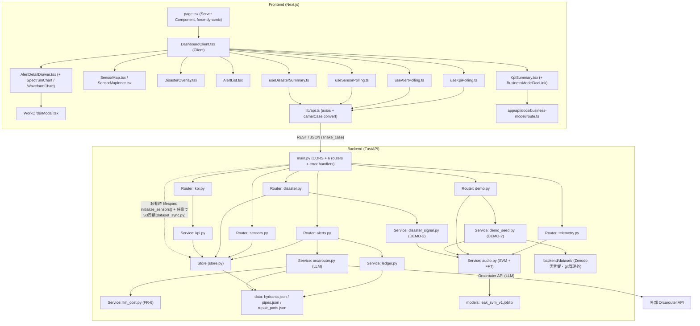
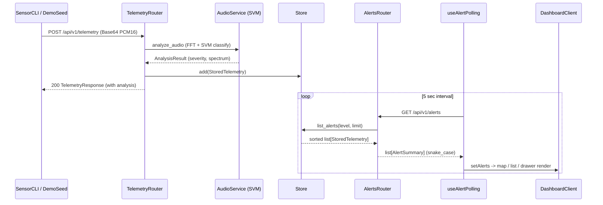
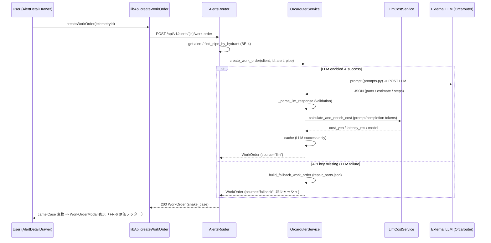
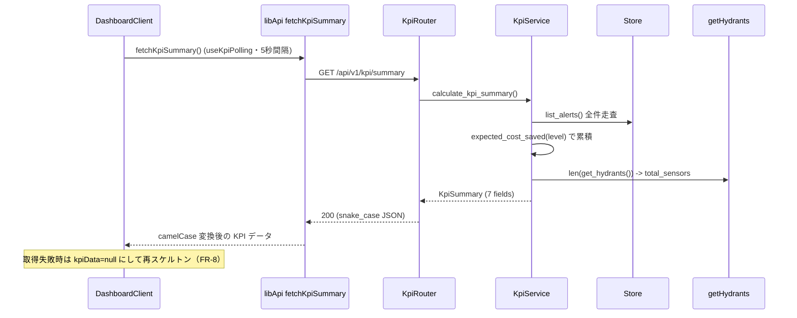
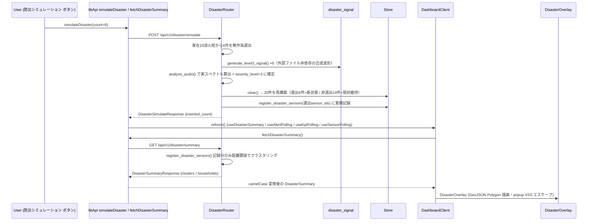

# SmartWater Guardian - システムアーキテクチャ

## アーキテクチャスタイル

単一リポジトリ構成。FastAPI 製**モノリシックバックエンド**（ルーター/サービス/ストアの3層）と
Next.js App Router 製フロントエンド（**Server Component ページ + Client Component ダッシュボード**）で構成。
本番用 DB は持たず、JSON マスタ + インメモリストアでデモを成立させる（CLAUDE.md §3 の範囲外遵守）。

- **バックエンド**: FastAPI（Python / Pydantic v2 strict）。同期 `def` + スレッドプール（CPU バウンドの
  音響解析はスレッドプール実行）。ルーターは薄く、ビジネスロジックはサービス層
  （audio / orcarouter / llm_cost / ledger / kpi）、データ保持はスレッドセーフなインメモリストア。
  外部 LLM（Orcarouter）連携は `services/orcarouter.py` にカプセル化。
- **フロントエンド**: Next.js App Router。`page.tsx` は Server Component（`force-dynamic`）で
  GeoJSON を取得し、`DashboardClient`（Client Component）へ渡す。アラート / KPI / 防災サマリは
  クライアントでポーリング。作業指示書は `AlertDetailDrawer` の「AI自動起票」ボタン → `WorkOrderModal`。
- **インフラ（INFRA-1）**: デモの受け渡しはローカル実行を主とし、余裕があれば AWS（CloudFormation +
  ECS Fargate + ALB）へデプロイ。運用コスト最適化のため WAF / Secrets Manager / Auto Scaling は不使用。

## コンポーネント関係図

（テキスト代替: フロントは `page.tsx` → `DashboardClient` が KpiSummary / SensorMap / DisasterOverlay /
AlertList / AlertDetailDrawer（配下に WorkOrderModal・チャート）を束ねる。データ取得は `lib/api.ts`
（axios + snake_case→camelCase 変換）が一本化し、ポーリングは useKpiPolling / useAlertPolling /
useSensorPolling / useDisasterSummary が担う（いずれも DEMO-2 で `refresh()` を追加し、
シード投入・シードクリア・防災シミュレーションボタン押下直後に即時反映する）。KPI の
「前提: docs/business-model.md」リンクは `app/api/docs/business-model/route.ts` が docs を配信。
バックエンドは `main.py` → 6 ルーター（telemetry / alerts / sensors / kpi / disaster / demo）。
telemetry・demo（`POST /demo/seed`）は audio サービス（SVM + FFT）を直接呼び、demo の
`seed-batch` は `demo_seed.py`（DEMO-2・20消火栓へ1レベルずつ割当て + audio 呼び出し）を、
disaster の `simulate` は `disaster_signal.py`（DEMO-2・外部ファイル非依存の合成Level3波形）を
経由して audio サービスを呼ぶ。alerts の work-order は orcarouter サービス（LLM + 原価算出）を呼ぶ。
データ源は `hydrants.json` / `pipes.json` / `repair_parts.json` / `leak_svm_v1.joblib`。
起動時（`lifespan`）は `initialize_sensors()` で20件Lv0の初期状態を構築し、環境変数
`DEMO_DATASET_S3_URI` があれば `dataset_sync.py` で AWS 環境向けに `backend/dataset/`
（Zenodo実音響・ライセンス上git管理外）をプライベートS3から同期する。）

## 層構造とデータフロー

- **Presentation 層（FE）**: `page.tsx`（サーバーサイドで GeoJSON を 1 回取得）→ `DashboardClient`（クライアント状態管理）
- **API 境界**: `lib/api.ts` が snake_case→camelCase 変換を「1 回だけ」実施。型契約は `types/api.ts` / `types/sensor.ts` / `types/disaster.ts`
- **API 層（BE）**: 6 ルーター。入力検証は Pydantic v2 strict / extra=forbid
- **サービス層（BE）**: `audio.py`（音響判定）・`orcarouter.py`（LLM 起票）・`llm_cost.py`（原価）・`ledger.py`（台帳照合）・`kpi.py`（コスト算定）・
  `demo_seed.py`（DEMO-2・一括シード投入）・`disaster_signal.py`（DEMO-2・合成Level3波形）・`dataset_sync.py`（DEMO-2・AWS向けS3データセット同期）
- **データ層（BE）**: `store.py`（インメモリ・スレッドセーフ）・`data/*.json`（マスタ）・`models/`（学習済みモデル）・`dataset/`（実音響WAV・git管理外）

## Interaction Diagrams

### 1. テレメトリ受信 → アラート生成 → ダッシュボード表示

（テキスト代替: 疑似センサー CLI / デモシードが音声を `POST /api/v1/telemetry` で送信 → telemetry ルーターが
`services/audio.py`（SVM + DSP）で解析し `StoredTelemetry` をストアに登録して 200 を返す。
フロントは `useAlertPolling` が 5 秒間隔で `GET /api/v1/alerts` をポーリングし、`DashboardClient` が
地図・一覧・詳細ドロワーを更新する。）

### 2. AI 自動起票（BE-5 / FE-6 / FR-6）

（テキスト代替: アラート詳細の「AI自動起票」ボタン → `createWorkOrder` → バックエンドが
`orcarouter.create_work_order` を実行。LLM 有効時はプロンプト送信 → レスポンス検証 → `llm_cost` で
1 起票あたりの API 原価（`cost_yen` / `latency_ms`）を付与してキャッシュ。LLM 未設定・失敗時は
規定ルールのフォールバック（`source: "fallback"`・非キャッシュ）を返す。WorkOrderModal が
概算見積・作業時間・原価（FR-6）を表示。）

### 3. KPI サマリ取得（BE-8 実装済み / FE-7 配線済み）

（テキスト代替: `useKpiPolling` が 5 秒間隔で `fetchKpiSummary()` を呼び、バックエンドがインメモリストアの
アラート実データからレベル別件数（level1/2/3_count）と推定削減コスト（estimated_cost_saved_yen）を
`docs/business-model.md` §3 の式で集計して返す。total_sensors は hydrants.json の実件数。常に
`is_estimate=True` と `assumption_doc` を付与する。**取得失敗時は古い値を最新として見せないため
kpiData を null に破棄し、スケルトン（`data-testid="kpi-skeleton"`）へ戻す**（FE-7 実装済み）。
KPI ランドマーク（section / h2 / aria-labelledby / aria-busy）は DashboardClient が一元所有する。）

### 4. 防災モード（BE-7 / DEMO-2 再設計）

> DEMO-2 で「東京駅周辺に架空センサーを新規追加」方式から「実在20消火栓のうち
> 無作為6件を書き換える」方式へ再設計した。監視センサー数は常に20のまま増加しない。

（テキスト代替: 防災シミュレーションボタン → `simulateDisaster(6)` が実在20消火栓のうち
無作為6件を選び、`disaster_signal.generate_level3_signal()`（合成波形。AWS環境でも
データセット不要で常に動作する）を `analyze_audio()` で解析して Level 3 に確定 →
ストアを20件（選出6件=新状態＋非選出14件=現状維持）に一括再構築 → 選出 sensor_id を
`register_disaster_sensors()` に累積記録 → `refresh()` で即時再取得 →
`GET /api/v1/disaster/summary` は**その累積記録分のみ**を距離閾値（300m）で
クラスタリングし、被災エリア Polygon・想定断水世帯・優先閉栓バルブを返す
（通常検知でLevel3になったセンサーは対象外）。実消火栓は数km単位で離れているため、
クラスタは選出センサー数に近い数（多くはほぼ1対1）になる。`DisasterOverlay` が
react-leaflet の `<GeoJSON>` で描画（popup は HTML エスケープで XSS 対策）。
シミュレーション未実施時は非表示。）

## 設計上の判断と代替案

| 判断 | 選択 | 代替案（検討） | 理由 |
|------|------|----------------|------|
| データ保持 | インメモリストア + JSON マスタ | 永続 DB | CLAUDE.md §3 で本番用大型 GIS DB はスコープ外。デモ優先 |
| バックエンド形態 | モノリス（3層） | マイクロサービス | 単一デモ要件・最小実装優先。境界はルーター/サービスで確保 |
| 音響解析 | SVM（scikit-learn）+ FFT（同期 def + スレッドプール） | 深層学習 | MVP 契約（8000Hz/1.0s）に十分な精度を最小構成で実現（BE-3） |
| LLM 起票 | Orcarouter API（プロキシ経由・API キー環境変数） | 自前 LLM 実装 | 補修部材選定・見積自動起票を外部 API で実現。フォールバックで可用性担保（BE-5） |
| 型の境界 | snake_case→camelCase を lib/api.ts で 1 回変換 | 各コンポーネントで個別変換 | 変換ロジックの重複と型の揺れを防ぐ（FE-1 規約） |
| KPI 配線 | DashboardClient でポーリング（FE-7 実装済み） | Server 側 1 回 fetch | アラートと KPI の更新タイミングを揃える（Issue 推奨）。失敗時は再スケルトン |
| 深刻度型 | `lib/severity.ts` に表示メタ同居（単一ソース） | 契約層のみで定義 | 表示メタ（SEVERITY_META / getSeverityColor 等）と同居させ、`types/api.ts` から re-export（FE-7 で解消済み） |
| クラウド | AWS（CloudFormation + ECS Fargate） | オンプレ・自宅サーバー | デモ受け渡しはローカル主体・余裕があれば AWS へ（INFRA-1）。コスト最適化で WAF/Secrets Manager 不使用 |

## 非機能設計の要点

- **整合性**: ストア操作は `threading.Lock` で保護。`deque(maxlen=500)` 満杯時は最古を索引と同期して破棄。
  LLM 起票は `asyncio.Lock` で直列化（並行安全）
- **性能**: `@lru_cache(maxsize=1)` でマスタ/モデル読込を初回のみに限定。FFT/SVM はスレッドプール実行
- **可用性・応答性**: ポーリング失敗時も最終状態を維持し控えめなエラー表示（画面を壊さない）。
  LLM 失敗時はフォールバック WorkOrder で可用性担保（非キャッシュ）
- **セキュリティ**: 入力境界で Pydantic strict / extra=forbid / Base64 検証。CORS は `ALLOWED_ORIGINS`
  環境変数で制御。Leaflet popup は HTML エスケープで XSS 対策。認証はスコープ外
- **コスト**: FR-6 で 1 起票あたりの LLM 原価を算出・表示。INFRA-1 はコスト最適化（NAT Gateway 1台・
  タスク各1・WAF 廃止）でデモ 1 日約 $3.5-4.5
- **観測性**: ログは Python 標準 logger / フロント console。LLM 起票は JSON 構造化ログ（FR-6）。SLO 未定義（デモスコープ）
